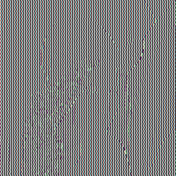

# simple-steg

## Description
The tool generates simple steganography.

## Usage
`python3 steg.py <String:filename> <float:parameter>`

## Example
`python3 steg.py example.png 0.5`

### generated hidden image 

### common image for extract

### result (common * hidden)

